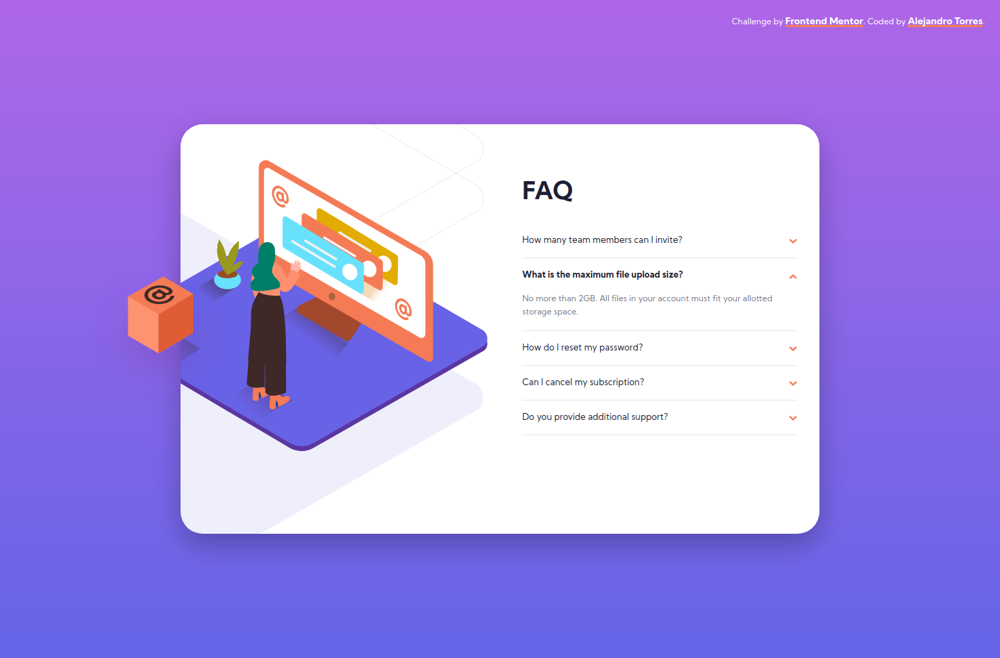
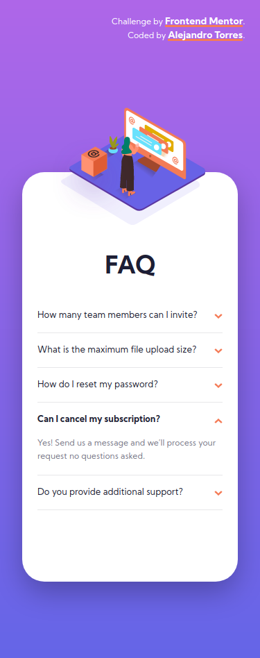

# Frontend Mentor - FAQ accordion card solution

[](https://app.netlify.com/sites/gallant-hodgkin-abb822/deploys)

This is a solution to the [FAQ accordion card challenge on Frontend Mentor](https://www.frontendmentor.io/challenges/faq-accordion-card-XlyjD0Oam). Frontend Mentor challenges help you improve your coding skills by building realistic projects.

## Table of contents

- [Overview](#overview)
  - [The challenge](#the-challenge)
  - [Screenshot](#screenshot)
  - [Links](#links)
- [My process](#my-process)
  - [Built with](#built-with)
  - [What I learned](#what-i-learned)
- [Author](#author)

## Overview

### The challenge

Users should be able to:

- View the optimal layout for the component depending on their device's screen size
- See hover states for all interactive elements on the page
- Hide/Show the answer to a question when the question is clicked

### Screenshot




### Links

- Solution URL: [Add solution URL here](https://github.com/atorres-io/frontend-mentor-faq-accordion-card)
- Live Site URL: [Add live site URL here](https://gallant-hodgkin-abb822.netlify.app/)

## My process

### Built with

- HTML5
- CSS3
- Flexbox
- ITCSS
- Framework Methodology

### What I learned

I have learned to make transitions with effect by affecting the height auto, thanks to max-height.

X No

```css
.faq label {
	height: 50px;
	overflow: hidden;
	cursor: pointer;
	transition: height 1s ease;
}

.faq input[type='radio']:checked + label {
	max-height: auto;
}
```

V YES

```css
.faq label {
	min-height: 50px;
	max-height: 0;
	overflow: hidden;
	cursor: pointer;
	transition: max-height 1s ease;
}

.faq input[type='radio']:checked + label {
	max-height: 100vh;
}
```

## Author

- Instagram - [@atorres.designs](https://www.instagram.com/atorres.designs/)
- Frontend Mentor - [@atorres-io](https://www.frontendmentor.io/profile/atorres-io)
- Github - [@atorres-io](https://github.com/atorres-io)
- Codepen - [@atorres-designs](https://codepen.io/atorres-designs)
- LinkedIn - [@atorresalcala](https://www.linkedin.com/in/atorresalcala)
